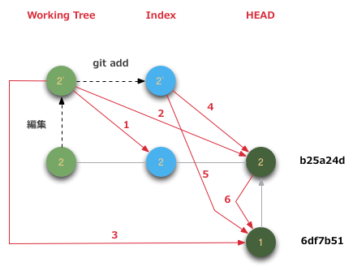
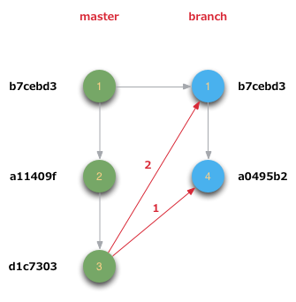

# git diff basic

git diffの基本メモ



## 1 

Working Tree(2`)とIndex(2)の差分

```bash
$ git diff
diff --git a/app.txt b/app.txt
index 7565d7c..df93d29 100644
--- a/app.txt
+++ b/app.txt
@@ -1,2 +1,3 @@
 app1
 app2
+app3
diff --git a/memo.txt b/memo.txt
index 1f8f509..c91b701 100644
--- a/memo.txt
+++ b/memo.txt
@@ -1,2 +1,3 @@
 memo1
 memo2
+memo3
```

ファイル指定

```bash
$ git diff app.txt
diff --git a/app.txt b/app.txt
index 7565d7c..df93d29 100644
--- a/app.txt
+++ b/app.txt
@@ -1,2 +1,3 @@
 app1
 app2
+app3
```

## 2

Working Tree(2`)とHEAD(2、b25a24d)の差分

```bash
$ git diff HEAD
diff --git a/app.txt b/app.txt
index 7565d7c..df93d29 100644
--- a/app.txt
+++ b/app.txt
@@ -1,2 +1,3 @@
 app1
 app2
+app3
diff --git a/memo.txt b/memo.txt
index 1f8f509..c91b701 100644
--- a/memo.txt
+++ b/memo.txt
@@ -1,2 +1,3 @@
 memo1
 memo2
+memo3
```

ファイル指定

```bash
$ git diff HEAD memo.txt
diff --git a/memo.txt b/memo.txt
index 1f8f509..c91b701 100644
--- a/memo.txt
+++ b/memo.txt
@@ -1,2 +1,3 @@
 memo1
 memo2
+memo3
```

## 3

Working Tree(2`)とHEAD(1, 6d7b51)の差分

```bash
$ git diff 6df7b51
diff --git a/app.txt b/app.txt
index a641e39..df93d29 100644
--- a/app.txt
+++ b/app.txt
@@ -1 +1,3 @@
 app1
+app2
+app3
diff --git a/memo.txt b/memo.txt
index dbb32c3..c91b701 100644
--- a/memo.txt
+++ b/memo.txt
@@ -1 +1,3 @@
 memo1
+memo2
+memo3
```

ファイル指定

```bash
$ git diff 6df7b51 memo.txt
diff --git a/memo.txt b/memo.txt
index dbb32c3..c91b701 100644
--- a/memo.txt
+++ b/memo.txt
@@ -1 +1,3 @@
 memo1
+memo2
+memo3
```

## 4

Index(2`)とHEAD(2, b25a24d)の差分

```bash
$ git diff --cached
diff --git a/app.txt b/app.txt
index 7565d7c..df93d29 100644
--- a/app.txt
+++ b/app.txt
@@ -1,2 +1,3 @@
 app1
 app2
+app3
diff --git a/memo.txt b/memo.txt
index 1f8f509..c91b701 100644
--- a/memo.txt
+++ b/memo.txt
@@ -1,2 +1,3 @@
 memo1
 memo2
+memo3
```

ファイル指定

```bash
$ git diff --cached memo.txt
diff --git a/memo.txt b/memo.txt
index 1f8f509..c91b701 100644
--- a/memo.txt
+++ b/memo.txt
@@ -1,2 +1,3 @@
 memo1
 memo2
+memo3
```

## 5

Index(2`)とHEAD(1, 6df7b51)の差分

```bash
$ git diff --cached 6df7b51
diff --git a/app.txt b/app.txt
index a641e39..df93d29 100644
--- a/app.txt
+++ b/app.txt
@@ -1 +1,3 @@
 app1
+app2
+app3
diff --git a/memo.txt b/memo.txt
index dbb32c3..c91b701 100644
--- a/memo.txt
+++ b/memo.txt
@@ -1 +1,3 @@
 memo1
+memo2
+memo3
```

ファイル指定

```bash
$ git diff --cached 6df7b51 app.txt
diff --git a/app.txt b/app.txt
index a641e39..df93d29 100644
--- a/app.txt
+++ b/app.txt
@@ -1 +1,3 @@
 app1
+app2
+app3
```

## 6

HEAD(2, b25a24d)とHEAD(1, 6df7b51)の差分

```bash
$ git diff 6df7b51 b25a24d
diff --git a/app.txt b/app.txt
index a641e39..7565d7c 100644
--- a/app.txt
+++ b/app.txt
@@ -1 +1,2 @@
 app1
+app2
diff --git a/memo.txt b/memo.txt
index dbb32c3..1f8f509 100644
--- a/memo.txt
+++ b/memo.txt
@@ -1 +1,2 @@
 memo1
+memo2
```

ファイル指定

```bash
$ git diff 6df7b51 b25a24d memo.txt
diff --git a/memo.txt b/memo.txt
index dbb32c3..1f8f509 100644
--- a/memo.txt
+++ b/memo.txt
@@ -1 +1,2 @@
 memo1
+memo2
```

# git diff branch

branch間のgit diffメモ



## 1

master(3)とbranch(4)の比較

```bash
$ git diff a0495b2 d1c7303
diff --git a/memo.txt b/memo.txt
index 78e12cc..c91b701 100644
--- a/memo.txt
+++ b/memo.txt
@@ -1,2 +1,3 @@
 memo1
-memo_branch1
+memo2
+memo3
```

git diff 差分をとるbranch名でもOK

```bash
$ git diff test
diff --git a/memo.txt b/memo.txt
index 78e12cc..c91b701 100644
--- a/memo.txt
+++ b/memo.txt
@@ -1,2 +1,3 @@
 memo1
-memo_branch1
+memo2
+memo3
```

## 2

master(3)とbranch(1)の差分

branchした箇所がわかればコミットIDを指定すればOK

```bash
$ git diff b7cebd3 d1c7303
diff --git a/memo.txt b/memo.txt
index dbb32c3..c91b701 100644
--- a/memo.txt
+++ b/memo.txt
@@ -1 +1,3 @@
 memo1
+memo2
+memo3
```

「...」を3つつけるとbranchした所の比較をしてくれる

```bash
$ git diff a0495b2...d1c7303
diff --git a/memo.txt b/memo.txt
index dbb32c3..c91b701 100644
--- a/memo.txt
+++ b/memo.txt
@@ -1 +1,3 @@
 memo1
+memo2
+memo3
```

2013/04/11 しのざく

以上
